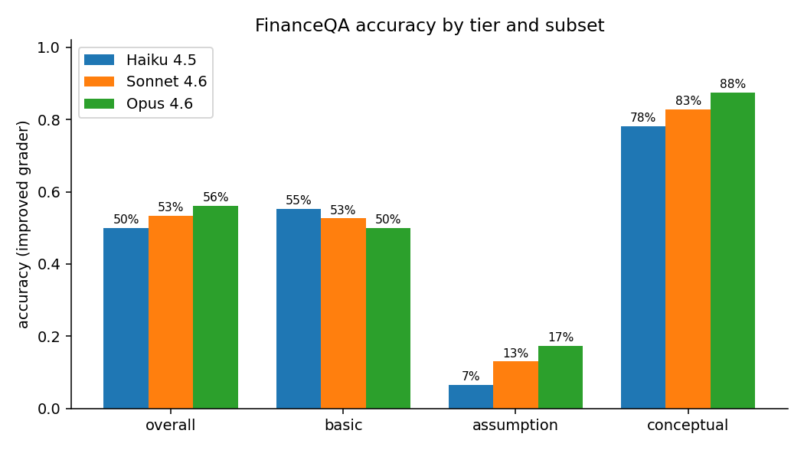
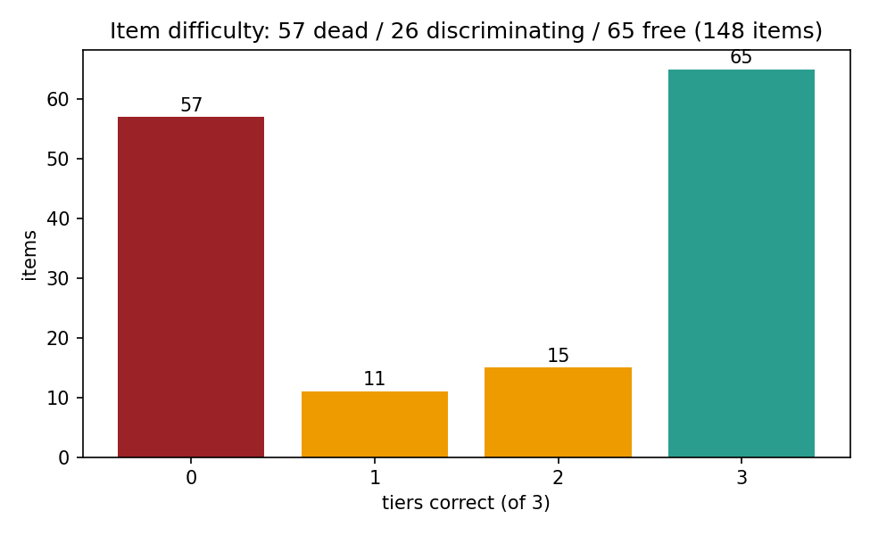
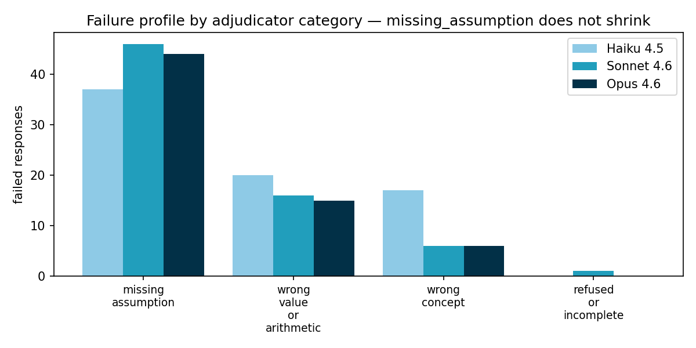
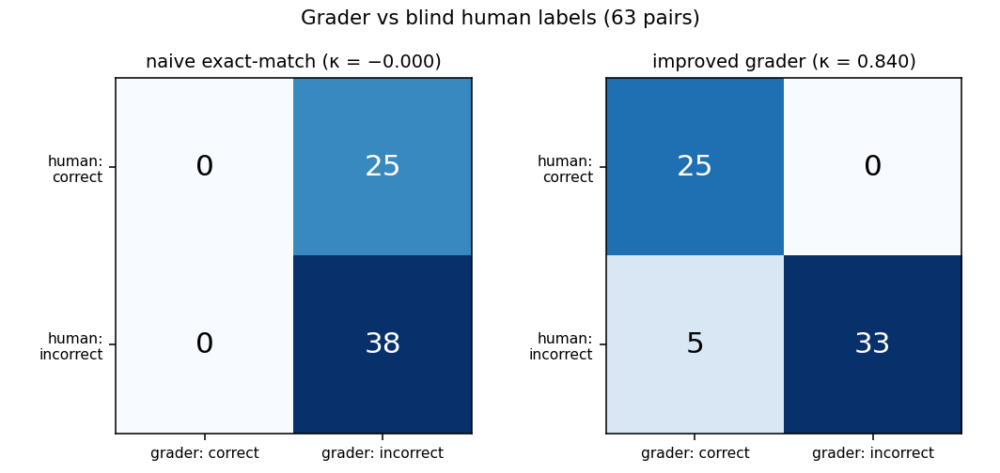
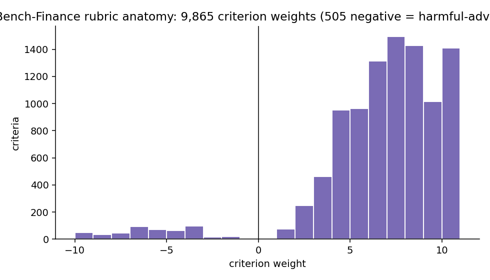
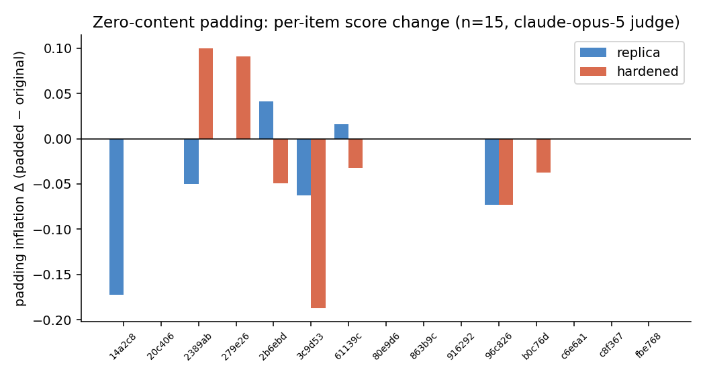
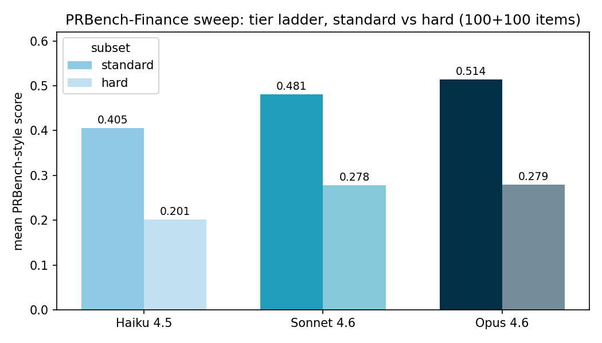
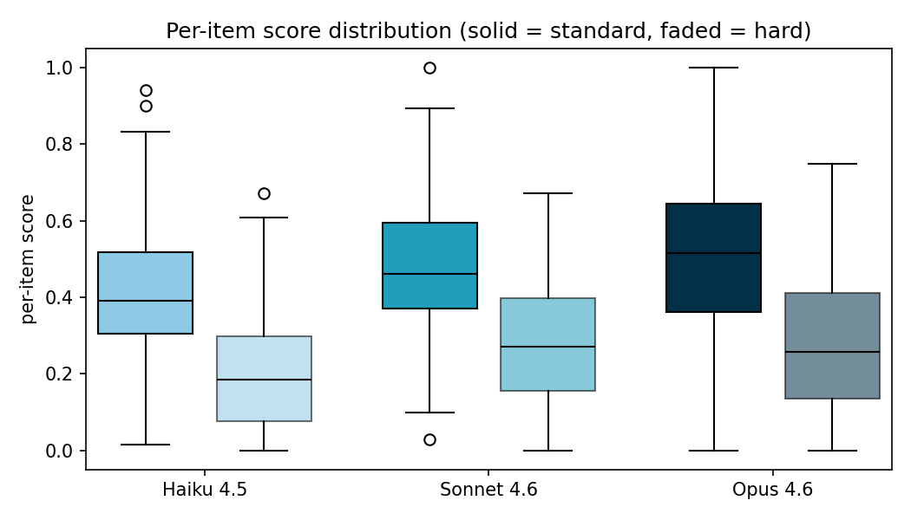
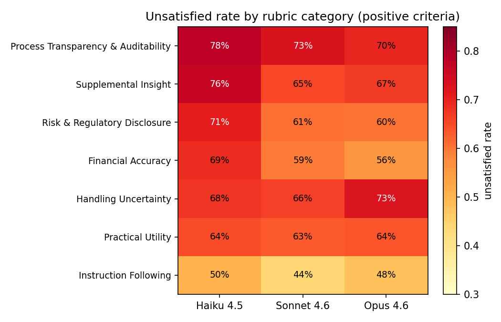

# P2 — Eval Critique, Improvement, and Measurement: FinanceQA + PRBench-Finance

## Contents

- [Benchmark Quality Assessment Plan](#benchmark-quality-assessment-plan)
  - [Prompt quality](#prompt-quality) · [Label quality](#label-quality) · [Rubric quality](#rubric-quality) · [Grader & judge quality](#grader--judge-quality) · [Measurement validity](#measurement-validity)
- [Benchmark A — FinanceQA](#benchmark-a--financeqa)
  - [A0 Overview](#a0--overview-findings-and-what-we-did-about-them)
  - [A1 Critique](#a1--critique-what-financeqa-measures-vs-what-it-claims)
    - Annexes: [A1 ladder](#annex-a1--tier-ladder-52) · [A2 difficulty](#annex-a2--item-level-difficulty-distribution-54) · [A3 dead items](#annex-a3--dead-item-deep-dive-22--54) · [A4 failure profile](#annex-a4--failure-profile--p3) · [A5 grader validity](#annex-a5--grader-validity-4144)
  - [A2 Improvement](#a2--improvement-a-published-validated-two-stage-grader)
  - [A3 Measurement](#a3--measurement-did-the-improvement-make-the-eval-better)
  - [A4 Runnable instructions](#a4--runnable-instructions-claude-readable)
- [Benchmark B — PRBench-Finance](#benchmark-b--prbench-finance)
  - [B0 Overview](#b0--overview-findings-and-what-we-did-about-them)
  - [B1 Critique](#b1--critique-what-prbench-finance-measures-vs-what-it-claims)
    - Annexes: [B1 rubric anatomy](#annex-b1--rubric-anatomy-31) · [B2 padding attack](#annex-b2--grader-validity-the-padding-attack-44) · [B3 ladder & difficulty](#annex-b3--tier-ladder--difficulty-52--54) · [B4 failure profile](#annex-b4--failure-profile--p3)
  - [B2 Improvement](#b2--improvement-a-hack-resistance-probe-and-a-hardened-judging-protocol)
  - [B3 Measurement](#b3--measurement-does-the-hardened-protocol-make-the-eval-better)
  - [B4 Runnable instructions](#b4--runnable-instructions-claude-readable)

## Benchmark Quality Assessment Plan

A benchmark-agnostic inventory of what can be wrong with an eval — the criteria we run every audited benchmark through. Five dimensions along the eval pipeline (what the item asks → what counts as right → how that's operationalized → who applies it) plus one whole-instrument dimension; twenty checks. The checklist deliberately mentions no specific benchmark; per-benchmark findings live in each benchmark's section (A1/B1). Each benchmark section also carries the same **standard annex series** — tier ladder (5.2), difficulty distribution (5.4), dead items / deep dives, failure profile (feeds P3), grader validity (4.x) — linked directly from that benchmark's checklist-scoring cells, so benchmarks can be compared annex-for-annex.

### Prompt quality

What the item asks: well-formed, answerable, coherent with the expected answer, non-redundant, time-stable.

| ID | Check | Failure looks like |
|---|---|---|
| 1.1 | Are prompts well-formed and unambiguous? | Malformed, self-contradictory, or accidentally underspecified items |
| 1.2 | Is each item answerable from the provided material plus stated conventions? | Gold requires context the item never supplies |
| 1.3 | Are prompt instructions coherent with expected answer form? | Prompt asks for one style, grading keys on another (format confound) |
| 1.4 | Are items free of duplicates / near-duplicates? | Redundant items inflate n without adding signal |
| 1.5 | Are items time-stable (or explicitly time-pinned)? | Answers drift with markets, rates, or filings |

### Label quality

What counts as right: gold answers free of noise, complete across defensible conventions, and consistent with the paper.

| ID | Check | Failure looks like |
|---|---|---|
| 2.1 | Are gold answers free of outright label noise? | Wrong answers in the answer key |
| 2.2 | Are golds convention-complete where professionals legitimately differ? | One gold where several defensible conventions exist, binary grading |
| 2.3 | Do the shipped labels/criteria match the paper's claims? | Counts, splits, or stats disagree with the publication |

### Rubric quality

How correctness is operationalized when grading is criteria-based rather than gold-based.

| ID | Check | Failure looks like |
|---|---|---|
| 3.1 | Is the rubric sound by construction (independent, precise, not gameable)? | Criteria satisfiable by generic boilerplate; overlapping or contradictory criteria |
| 3.2 | Is the rubric comprehensive for the task it grades? | Salient failure or success modes carry no criterion |

### Grader & judge quality

Who applies the standard: reproducible, validated, format-invariant, adversarially robust, stable.

| ID | Check | Failure looks like |
|---|---|---|
| 4.1 | Is the grader published and reproducible? | Manual or unpublished grading; scores can't be regenerated |
| 4.2 | Is the judge validated against human judgment? | No agreement statistic, or a weak one, for a judge-produced score |
| 4.3 | Is grading invariant to answer formatting? | Correct answers rejected over surface form |
| 4.4 | Does grading resist adversarial responses? | Padding, keyword-stuffing, or incidental matches change scores |
| 4.5 | Are scores stable across repeated runs? | pass@1 ≫ pass^k; single-run scores presented as the score |

### Measurement validity

Whole-instrument properties: construct, discrimination, power, difficulty placement, contamination.

| ID | Check | Failure looks like |
|---|---|---|
| 5.1 | Does the aggregate measure the capability claimed? | Item sample too narrow for the construct named in the title |
| 5.2 | Does the score separate model tiers? | Flat or inverted capability ladders |
| 5.3 | Is n large enough at every reported granularity? | Subset scores inside their own confidence intervals |
| 5.4 | Is the difficulty distribution informative and stable? | Saturated subsets; difficulty defined relative to today's models |
| 5.5 | Is the answer key protected (contamination, freshness)? | Public answer keys; eval set = public set; no refresh |

**Scope notes.** Out-of-scope checks, stated so absence isn't read as a pass: cross-family judge validation — all LLM verdicts here are Claude judging Claude, a self-preference risk bounded only by the human-label κ (needs non-Anthropic keys; see not_done.md), inter-annotator agreement on the original benchmarks (raw annotations unreleased), cost-normalized scoring (leaderboard property, not instrument property). TBD queue — auditable in principle, not performed in this box: 1.4 duplicate detection (both benchmarks), 1.5 time-stability (PRBench), 3.2 rubric comprehensiveness (PRBench), 4.5 run-to-run consistency (both — needs repeated runs). (5.2 tier separation for PRBench, formerly queued here, was measured by the 200-item × 3-tier sweep — Annex B3.)

## Benchmark A — FinanceQA

### A0 — Overview: findings and what we did about them

Generated from the A1 checklist scoring: every fail and weak row lands here exactly once (merged where one action covers several checks). Action statuses: **done** (shipped in this repo, measured), **quantified-deferred** (fix specified and costed, deliberately not applied), **planned-P5** (durable fix is the vendor extension), **recommended-upstream** (only the maintainer can fix it), **documented** (no fix exists; stated so it can't be missed).

| Severity | Check(s) | Finding | Action & status | Measurement / evidence |
|---|---|---|---|---|
| **high** | 1.3, 4.3 | Format confound between prompt style and gold strings | **done** — scale/format-invariant Stage 1 matching | Perturbation probe: naive EM accepts 0.6% of correct variants; improved stage 100% (340 probes) |
| **high** | 2.2, 1.2 | Single golds where conventions legitimately differ; conventions unstated in items | **done** (measurement) — adjudicator's `defensible_alternative` channel quantifies the ambiguity; **planned-P5** (durable fix) — `accepted_alternatives` + `assumption_named` fields in the item spec | 55% of judged-incorrect responses used a defensible alternative (114/208) |
| **high** | 4.1 | No published grader; scores unreproducible | **done** — built the missing grader: deterministic numeric stage + Opus 5 adjudicator (`p2/financeqa/`) | κ = 0.840 vs blind human labels; naive EM κ = −0.000 |
| **high** | 5.5 | Answer key public since 2025-01; eval set = public set | **planned-P5** — fresh items on last-12-month filings; no in-box fix exists | Documented; leaderboard drift (o3 54.1% > paper-era best) flagged |
| **mid** | 4.4 | Stage-1 false-accepts on incidental numbers | **quantified-deferred** — bare-gold gate specified; 63 judge calls (~$1.5) to apply; held to keep checked-in numbers exactly reproducible | False-accept channel measured at 7.9% (5/63), all on sentence-like golds |
| **mid** | 5.1, 5.3 | One issuer + context-free subset narrow the construct; assumption subset n=46 | **planned-P5** — ≥20 issuers, ≥5 sectors, 120 assumption items | CI stated wherever subset scores appear (±10pp at 95%) |
| **mid** | 5.2 | Degenerate discrimination under naive grading (0 = 0 = 0) | **done** — same grader restores the ladder | Monotone 50.0 / 53.4 / 56.1% (Haiku → Sonnet → Opus 4.6) |

### A1 — Critique: what FinanceQA measures vs. what it claims

**Claim.** FinanceQA ([arXiv:2501.18062](https://arxiv.org/abs/2501.18062)) presents itself as "a benchmark for evaluating financial analysis capabilities," graded by "exact correct matches ... no partial points," with the headline finding that frontier models fail ~half of professional-grade tasks and answer <5% of assumption-based questions correctly.

**What it actually measures**, and the design flaws that sit between the claim and the measurement. All of these were verified against primary sources (the paper, the HF dataset, the GitHub repo) on 2026-08-04; the flaws are our own findings — no published critique of FinanceQA exists that we could find.

1. **The grader does not exist as an artifact.** Grading in the paper was performed by human annotators; no grader code was ever published (the GitHub repo contains a README and the paper PDF — nothing else). Every score produced since — including AfterQuery's own leaderboard, which reports o3 = 54.1% — rests on an unpublished, unreproducible grading process. Anyone re-running the benchmark must improvise their own grader, and the improvised choice can move the headline by tens of points (Part 3 quantifies this).

2. **Format confound between prompt and gold labels.** The prescribed prompt says "Provide a concise answer," while gold answers are strings like `"$32,095 (in millions)"`. A model answering `"$32.1 billion"` — numerically identical — fails any naive string-matching reimplementation. Our controlled probe (below) shows naive exact-match accepts only **0.6%** of correct-by-construction reformatting variants of the gold answers. Any automated reimplementation that is not explicitly scale- and format-invariant measures formatting compliance, not financial analysis.

3. **Ambiguous gold labels on assumption items.** The 46 assumption-based questions deliberately withhold information so the model must "make reasonable assumptions" — but the grading is binary against a single gold answer. Where more than one professionally defensible convention exists (e.g., what to add back into adjusted EBITDA), a defensible-but-different answer scores identically to a garbage answer. This inflates the difficulty signal of exactly the subset the paper's headline finding is about. Our improved grader separates these cases with an explicit `defensible_alternative` flag.

4. **Public set = eval set, answers included, since Jan 2025.** We verified the paper's reported percentages reconcile exactly against the public 148 rows (e.g., 0.022 = 1/46 assumption items), so there is no held-out split — and the CSV on HuggingFace ships gold answers *and* chain-of-thought rationales. Post-release leaderboard gains (o3 at 54.1% vs. paper-era o1 at 48.7%) cannot be distinguished from contamination.

5. **Single-document concentration.** All 84 tactical items derive from one Costco FY2024 10-K. Costco is also an unusually clean filer. The benchmark measures analysis of one document from one retailer — any claim of generality across sectors, filing quality, or fiscal-year conventions is unsupported, and one contaminated document collapses the whole tactical half.

6. **The headline "sub-5% on assumptions" conflates capability with grading artifact.** Given flaws 2 and 3, part of the 40-point spread between basic (~45%) and assumption (<5%) questions could be produced by the grading pipeline rather than by model incapability. This is a testable claim, and Part 3 tests it: we re-grade with a format-invariant, convention-aware instrument and report how much of the gap survives. (Preview: most of it survives — the capability gap is real — but the absolute scores move materially.)

**What we did NOT engage with** (scope choices, stated for honesty): flaw 4 (contamination) needs fresh items on fresh documents — that is the P5 vendor brief's job, not a 24-hour fix; flaw 5 (single document) likewise. This P2 targets flaws 1–3 and 6: the grader.

#### A1 Checklist scoring

FinanceQA scored against every check of the Assessment Plan. Statuses: **fail** (confirmed with evidence), **weak** (partial), **pass** (checked, clean), **TBD** (audit not yet performed; reason given), **n/a**.

| ID | Dimension | Check | Failure looks like | Result |
|---|---|---|---|---|
| 1.1 | Prompt quality | Are prompts well-formed and unambiguous? | Malformed, self-contradictory, or accidentally underspecified items | pass* — spot-checked over 63 adjudicated pairs; assumption items are *deliberately* underspecified (the construct, not a defect) |
| 1.2 | Prompt quality | Is each item answerable from the provided material plus stated conventions? | Gold requires context the item never supplies | weak — 64/148 items ship no context by design; tactical items need unstated analyst conventions (interacts with 2.2) |
| 1.3 | Prompt quality | Are prompt instructions coherent with expected answer form? | Prompt asks for one style, grading keys on another (format confound) | **fail** — "provide a concise answer" vs golds like `"$32,095 (in millions)"` [→ Annex A5](#annex-a5--grader-validity-4144) |
| 1.4 | Prompt quality | Are items free of duplicates / near-duplicates? | Redundant items inflate n without adding signal | TBD — not audited (n=148, single annotator team; low risk) |
| 1.5 | Prompt quality | Are items time-stable (or explicitly time-pinned)? | Answers drift with markets, rates, or filings | pass — pinned to one FY2024 filing |
| 2.1 | Label quality | Are gold answers free of outright label noise? | Wrong answers in the answer key | pass* — no outright-wrong gold surfaced in 63 adjudicated pairs |
| 2.2 | Label quality | Are golds convention-complete where professionals legitimately differ? | One gold where several defensible conventions exist, binary grading | **fail** — single gold + binary grading; 55% of judged-incorrect responses (114/208) used a defensible alternative convention [→ Annex A3](#annex-a3--dead-item-deep-dive-22--54) |
| 2.3 | Label quality | Do the shipped labels/criteria match the paper's claims? | Counts, splits, or stats disagree with the publication | pass — the public 148 rows reconcile *exactly* with the paper's Table 1 |
| 3.1 | Rubric quality | Is the rubric sound by construction (independent, precise, not gameable)? | Criteria satisfiable by generic boilerplate; overlapping or contradictory criteria | n/a — no rubric |
| 3.2 | Rubric quality | Is the rubric comprehensive for the task it grades? | Salient failure or success modes carry no criterion | n/a |
| 4.1 | Grader & judge quality | Is the grader published and reproducible? | Manual or unpublished grading; scores can't be regenerated | **fail** — grading was human, binary, unpublished; no code ever shipped [→ Annex A5](#annex-a5--grader-validity-4144) |
| 4.2 | Grader & judge quality | Is the judge validated against human judgment? | No agreement statistic, or a weak one, for a judge-produced score | previously unmeasurable; our replacement grader validated at **κ = 0.840** vs blind human labels (naive EM: κ = −0.000) [→ Annex A5](#annex-a5--grader-validity-4144) |
| 4.3 | Grader & judge quality | Is grading invariant to answer formatting? | Correct answers rejected over surface form | **fail** → fixed; naive EM accepts 0.6% of correct-by-construction variants, improved stage 100% (340 probes) |
| 4.4 | Grader & judge quality | Does grading resist adversarial responses? | Padding, keyword-stuffing, or incidental matches change scores | weak — Stage-1 incidental-number false-accepts measured at 7.9% (5/63); one-line fix quantified but deliberately not applied, keeping checked-in numbers reproducible [→ Annex A5](#annex-a5--grader-validity-4144) |
| 4.5 | Grader & judge quality | Are scores stable across repeated runs? | pass@1 ≫ pass^k; single-run scores presented as the score | TBD — needs repeated runs (out of budget) |
| 5.1 | Measurement validity | Does the aggregate measure the capability claimed? | Item sample too narrow for the construct named in the title | weak — "financial analysis" measured via one issuer's 10-K + 64 context-free concept questions |
| 5.2 | Measurement validity | Does the score separate model tiers? | Flat or inverted capability ladders | **fail** under any naive reimplementation (0 = 0 = 0); restored by the improved grader to a monotone 50.0 / 53.4 / 56.1% [→ Annex A1](#annex-a1--tier-ladder-52) |
| 5.3 | Measurement validity | Is n large enough at every reported granularity? | Subset scores inside their own confidence intervals | weak — assumption subset n=46 ⇒ ±10pp binomial noise at 95%; stated wherever subset scores appear |
| 5.4 | Measurement validity | Is the difficulty distribution informative and stable? | Saturated subsets; difficulty defined relative to today's models | **fail** — item-level analysis ([Annexes A2–A3](#annex-a2--item-level-difficulty-distribution-54)): 57/148 items dead (0/3 models correct) + 65/148 free (3/3) ⇒ only **26 items (18%) separate tiers**, 14 of them conceptual; 11 of 16 dead *basic* items are convention traps (≥2/3 wrong answers judged defensible) [→ Annexes A2–A3](#annex-a2--item-level-difficulty-distribution-54) |
| 5.5 | Measurement validity | Is the answer key protected (contamination, freshness)? | Public answer keys; eval set = public set; no refresh | **fail** — public set = eval set; answers + chain-of-thought on HF since 2025-01 |

#### Annex A1 — Tier ladder (5.2)

Monotone overall under the improved grader (50.0 → 53.4 → 56.1%); the basic-subset inversion is dug out in [Annex A3](#annex-a3--dead-item-deep-dive-22--54).



#### Annex A2 — Item-level difficulty distribution (5.4)

For each of the 148 items: how many of the three tiers (Haiku 4.5 / Sonnet 4.6 / Opus 4.6) answered it correctly under the improved grader. Computed from `p2/financeqa/results/grades.csv` at zero API cost.



The distribution is extremely bimodal: **57 items are dead** (all three tiers fail) and **65 are free** (all three pass) — **82% of the benchmark carries no between-tier ranking signal**, and the entire tier ordering rests on 26 items (14 conceptual, 8 assumption, 4 basic). Two readings, both needed: (a) as a *ranking* instrument at today's frontier, FinanceQA is running on 18% of its mass — n=26 with all the attendant noise; (b) dead and free items still measure *absolute* capability — the 37 dead assumption items are exactly the capability cliff P3 is about, and they would discriminate against a stronger future model. The skew is a fact about difficulty *placement*, not a reason to delete items — but a 200-item extension (P5) should target the 1/3–2/3 band deliberately.

#### Annex A3 — Dead-item deep dive (2.2 × 5.4)

The 16 dead **basic** items deserve suspicion: "basic" means the answer is derivable from the excerpt, so three tiers all failing suggests the item, not the models. The adjudicator's defensible-alternative flags confirm it: **11 of 16 dead basic items had ≥2 of 3 "wrong" answers judged professionally defensible** — they are convention traps, not hard questions. The full 16, with the convention fork that kills them:

| row | question (verbatim, truncated) | gold | failure pattern |
|---|---|---|---|
| 23 | What is the marginal tax rate in 2024? | 24.00% | all 3 defensible — models answer 21% federal statutory; gold wants fed + state from the tax table |
| 27 | Calculate Operating Deferred Tax Asset, net of deferred tax liabilities in 2024 | −$535M | 0/3 defensible — models net the balance-sheet DTA/DTL lines; gold nets the *operating* components |
| 28 | Same, 2023 | −$574M | same fork as 27 |
| 33 | How much cash and cash equivalents did Costco have at year end 2024? | $11,144M | all 3 defensible — models quote the literal balance-sheet line ($9,906M); gold's convention adds short-term investments |
| 56 | What is operating cash for 2024? (min of 2% of revenue and cash) | $5,089M | wrong_concept ×3 — models misread the min() construction |
| 57 | What is excess cash in 2024 …? | $6,055M | all 3 defensible — inherits row 33's cash convention |
| 67 | Calculate ARPU for 2024 | $3,457.24 | all 3 defensible — three member-count denominators are defensible; gold picks paid households |
| 71 | How many new members joined in 2024? | 11,945 | 0/3 defensible — requires netting gross adds vs renewals from two notes |
| 72–73 | Operating working capital 2023 / change YoY | −$6,662M / −$182M | cash-convention + operating-cash forks compound |
| 75 | Calculate levered free cash flow for 2024 | $5,921M | all 3 defensible — LFCF definition family (CFO−capex vs EBITDA-bridge) |
| 76–77 | AR days / AP days for 2024 | 3.59x / 30.29x | all/2 defensible — 360 vs 365, revenue vs COGS denominators |
| 80 | Calculate Asset Turnover for 2024 | 3.67x | all 3 defensible — net sales vs total revenue denominator |
| 81–82 | Sales per store / per sq ft 2024 | $285.90 / $1,943.87 | all 3 defensible — same net-sales fork |

**The basic-subset inversion, dug out.** Haiku 55.3% > Opus 4.6 50.0% on basic items looks like an embarrassment for the eval; item-level flips explain it precisely. The magnitude is noise (a 2-item gap at n=38, per-model SE ≈ ±8pp) — but the mechanism is not: **all three items Haiku gets right and Opus gets wrong (rows 0, 5, 7: gross profit, EBITDA margin, operating margin) are the same single convention fork** — Opus computes on Net Sales ($249,625M) where the gold uses Total Revenue ($254,453M). Haiku takes the naive top-line reading and matches the gold; Opus makes the more analyst-typical choice (for a retailer, margining merchandise economics on net sales — membership fees carry no COGS — is arguably the *stronger* convention, and the adjudicator flagged Opus's row-0 answer defensible) and is punished for it. Defensible-alternative share among basic errors is flat across tiers (65 / 67 / 68%). The lesson compounds check 2.2: under single-gold grading, **increased capability can *raise* collision rates with the gold's convention** — sophistication reads as error. The reverse flip (row 70, Opus right / Haiku wrong) is an ordinary arithmetic slip, no pattern.

The cluster structure is the point: rows 33/57/72/73 share one convention (cash includes ST investments), rows 80/81/82 share another (total revenue denominator) — a handful of unstated convention choices generates a third of the dead mass. This is check 2.2 and check 5.4 turning out to be the *same defect* seen from two angles, and it is exactly what the P5 spec's `accepted_alternatives` + `assumption_named` fields exist to fix. Curiosity: the single assumption item all three tiers solve (row 18, WACC, gold 9.56%) is the most formulaic item in the subset — textbook recall survives where convention judgment fails.

#### Annex A4 — Failure profile (→ P3)

The `missing_assumption` block does not shrink as tier rises — the visual core of P3 Mode 1.



#### Annex A5 — Grader validity (4.1–4.4)

Naive exact-match collapses onto "incorrect" (κ = −0.000); the improved grader's verdicts sit on the diagonal (κ = 0.840); the 5 off-diagonal false-accepts are the measured 4.4 channel.



### A2 — Improvement: a published, validated, two-stage grader

FinanceQA's most fixable defect is that its grading procedure is a private human process with no reproducible artifact. The improvement is the thing the benchmark shipped without: **a fully specified, runnable grader**, plus the validity evidence that it grades the construct (numeric equivalence + analyst judgment) rather than surface form.

**Design (deliberately boring):**

- **Stage 0 — naive EM (baseline, kept for comparison).** Normalized string equality. This is what a careless reimplementation of "exact match" does, and it is the counterfactual against which the improvement is measured.
- **Stage 1 — deterministic numeric equivalence** (`p2/financeqa/graders.py`). Parses gold and response into (value × scale) interpretations — handling `$`, commas, parentheses-negatives, `%` vs fractions, `x` multiples, scale words (`million`, `bn`, `M`, `(in millions)` context) — and auto-accepts when any response number matches the gold's primary number within 0.5% relative tolerance. Sign-presentation flips (expense as positive vs parenthesized) are accepted. Deterministic, dependency-free, unit-tested.
- **Stage 2 — LLM adjudicator for everything Stage 1 does not accept** (`p2/financeqa/grade.py`, `claude-opus-5`, a model deliberately outside the graded tier ladder to avoid self-grading). The adjudicator sees the question, source context, gold answer, gold chain of thought, and candidate answer, and must grade **strictly and binarily** (preserving the paper's no-partial-credit philosophy) — but records two extra fields: `defensible_alternative` (incorrect, but reached via a professionally defensible convention — the label-noise signal from flaw 3) and a `failure_category` (feeds P3).

#### How the adjudicator was built — a reusable judge recipe

The judge is the riskiest component of any grader, so its construction is documented as a recipe (each step names where it is instantiated in this repo):

1. **Minimize the judge's jurisdiction.** Grade deterministically wherever determinism can decide (`graders.py` Stage 1); send the judge only the remainder. Here 160/444 verdicts never touch an LLM, and the headline assumption ladder is 100% judge-free (§Judge-independence).
2. **Anchor to references, don't ask for preferences.** The judge receives question + source context + gold answer + gold chain-of-thought and performs *verification* (`grade.py::JUDGE_SYSTEM`) — the low-exposure regime for self-preference bias, vs. open "which answer is better" judging.
3. **Pin the grading philosophy in the prompt.** Binary, no partial credit (mirroring the target benchmark), with tolerance defined numerically (0.5% relative) — leave the judge no discretion over *standards*, only over *facts*.
4. **Give the verdict side-channels.** Alongside correct/incorrect, the judge emits `defensible_alternative` and `failure_category` — critique data (the 55% finding, the P3 categories) then falls out of grading for free.
5. **Pick a judge outside the graded set, cache verdicts, keep runs idempotent** (`JUDGE_MODEL = claude-opus-5`; `judge_cache.jsonl`). For mechanical binary checks, low effort suffices and cuts cost (`p2/prbench/run_probe.py`).
6. **Validate against blind human labels, then read the disagreements.** κ = 0.840 on 63 blind pairs is the certification; the five disagreements were the *discovery* — a Stage-1 defect (incidental-number false-accepts), not a judge defect. The validation loop audits the whole grader, including its deterministic parts.
7. **Adversarially probe the protocol and report judge-independence.** The padding attack (B2–B3) tests gameability; the judge-independence section reports which conclusions survive with no judge at all. Both belong in the eval's documentation, not in a drawer.

The final score under the improved grader: correct = Stage-1 accept OR Stage-2 "correct". Naive EM is reported alongside throughout.

**Measurement setup.** All 148 items × three same-generation model tiers (`claude-haiku-4-5`, `claude-sonnet-4-6`, `claude-opus-4-6`, all with thinking off, paper-exact prompt), so tier separation is a within-generation capability ladder, not a generation confound.

### A3 — Measurement: did the improvement make the eval better?

"Better" is a claim about the instrument. We test three concrete properties.

#### Property 1 — Format invariance under controlled perturbation

For every gold answer with a parseable primary number, we generate correct-by-construction surface variants (scale-shifted `$32,095 million` ↔ `$32.095 billion`, suffixed `$32,095M`, percent-vs-word, sentence-wrapped, symbol-stripped). A valid grader must accept 100% of them; every rejection is a measured format confound.

| grader | acceptance on 340 non-identity correct variants |
|---|---|
| naive exact match | **0.6%** |
| improved grader (Stage 1 alone — no LLM needed) | **100.0%** |

This is the cleanest number in the study: the baseline grader fails 99.4% of correct answers that are merely formatted differently, and the deterministic stage of the improved grader fixes all of it before any LLM judging is involved. *(Reproduce: `python3 p2/financeqa/perturb.py`, no API cost.)*

#### Property 2 — Grader–human agreement

63 stratified (item × model) response pairs (7 per question type per model, drawn blind — the template shows no grader verdicts) were adjudicated against the gold answer and gold chain of thought, then compared to each grader. Labels with per-pair notes are checked in at `p2/financeqa/data/human_labels.csv`. (Disclosure: the adjudication was performed by the take-home author working with Claude; it is independent of both graders and blind to their verdicts, but it is not an independent-SME panel — that is what P5 commissions.)

| grader | agreement with human | Cohen's κ |
|---|---|---|
| naive exact match | 60.3% | **−0.000** |
| improved | 92.1% | **0.840** |

Naive EM's κ is exactly zero because it has one behavior — say "incorrect" — so its 60.3% raw agreement is pure base rate. The improved grader's κ = 0.840 is substantial; for calibration, PRBench's published judge–expert agreement is κ = 0.603, so this grader is measurably tighter than the only comparable finance instrument that reports the statistic.

**The five disagreements are one defect, and the check caught it.** In all five (5/63 = 7.9%), the human said *incorrect* while Stage 1 had auto-accepted: the gold's number appeared *incidentally* in a wrong response — gold "3x MOIC" matching the "3." of a markdown list ordinal; gold "60M increase" matching a mentioned "$60M acquisition" in a response whose final answer was "EV is unaffected". All five golds are sentence-like or multi-part ("60M increase", "3x MOIC, 25% IRR", three-statement narratives) — none are bare quantities like `"$32,095 (in millions)"`, where Stage 1 made no errors. The improved grader therefore never *under*-credits (no false rejects observed) but has a measured ~8% false-accept channel confined to non-bare golds.

**Proposed fix, quantified but deliberately not yet applied:** restrict Stage-1 auto-accept to bare-quantity golds and route sentence-like golds to the judge unconditionally. Rerunning the routing rule offline shows 63 of the current 160 Stage-1 accepts would be re-routed (≈63 extra judge calls, ~$1.5). We held this back to keep the checked-in numbers exactly reproducible from the checked-in code and within the approved budget; the defect, its measured size, and the one-line fix (`p2/financeqa/grade.py`, gate on a bare-gold regex) are documented here instead. This is the validity loop working as intended: the human-agreement check exists precisely to surface what the deterministic probe cannot.

#### Property 3 — Tier separation

A finance eval that cannot rank Haiku < Sonnet < Opus within one model generation is not measuring capability. Accuracy per tier under each grader (all 148 items):

| grader | Haiku 4.5 | Sonnet 4.6 | Opus 4.6 | Sonnet−Haiku | Opus−Sonnet | monotone? |
|---|---|---|---|---|---|---|
| naive exact match | 0.0% | 0.0% | 0.0% | +0.0 | +0.0 | degenerate |
| improved | 50.0% | 53.4% | 56.1% | +3.4pp | +2.7pp | **yes** |

The baseline grader scores **every model at exactly zero** — not a single response out of 444 string-matches its gold label, so naive EM has no discriminative power at all: the "tier separation" it reports is the degenerate 0=0=0. The improved grader recovers a clean monotone ladder, and puts Opus 4.6 (56.1%) in the same range as the AfterQuery leaderboard's current best (o3 = 54.1%) — a sanity anchor, not a claim of comparability, since their grading process is unpublished.

Where the separation lives is itself a finding (item-level detail: Annexes A2–A3): **basic** lookup questions are non-monotone (Haiku 55.3% > Sonnet 52.6% > Opus 50.0%) — the gap is sampling noise in size but not in mechanism: every Haiku-over-Opus flip is one net-sales-vs-revenue convention fork (dug out in Annex A3), i.e., Mode-2 collisions rising with capability. The capability ladder shows up in **assumption** (6.5% → 13.0% → 17.4%) and **conceptual** (78.1% → 82.8% → 87.5%) questions. An eval buyer who wants model-ranking power should weight those subsets; the basic subset is a floor check.

**The monotonicity issue, worked end-to-end.** Tier monotonicity is the measurement-validity property this eval fails twice, and both failures resolve with numbers. (i) Under any naive reimplementation of the unpublished grading, monotonicity is destroyed outright — 0 = 0 = 0 — and the improved grader restores the 50.0 → 53.4 → 56.1% ladder above (κ = 0.840 vs human labels). (ii) A residual inversion remains on the basic subset (Haiku 55.3% > Opus 50.0%): the item-level dig (Annex A3) shows the 2-item gap is sampling noise (SE ≈ ±8pp at n=38) but the flips are systematic — every item Haiku wins is the same net-sales-vs-total-revenue fork, where Opus's more analyst-typical convention is graded wrong. Single-gold grading punishes sophistication; the measured resolution is that ranking power genuinely lives in the assumption ladder (6.5 → 13.0 → 17.4%, fully deterministic) and conceptual ladder (78.1 → 82.8 → 87.5%), and the durable fix (multi-reference golds) is a hard requirement in the P5 spec.

#### Judge-independence robustness

Because every LLM verdict in this repo comes from a Claude judge (see `not_done.md` §1), it matters which conclusions survive with **no judge at all**. Of 444 verdicts, 160 were decided purely by the deterministic Stage 1 (no LLM); restricting to deterministic-only grading: the tactical-84 tier ladder stays monotone (27.4 / 28.6 / 31.0%), and — the important one — **the assumption-subset ladder (6.5 / 13.0 / 17.4%) is 100% deterministic**: the benchmark's headline finding, and everything P3/P4 build on it, involves no LLM judge anywhere. Judge exposure is confined to the conceptual subset and to upgrading near-miss tactical answers; both are bounded by the human-label κ. The Benchmark B probe's Δ is additionally a same-judge contrast, so family bias differences out of the padded−original comparison.

#### And the headline claim

The paper's release-time headline — models answer **<5%** of assumption-based questions correctly — replicates directionally but not literally under the improved grader: Haiku 6.5%, Sonnet 13.0%, Opus 4.6 17.4% on the same 46 items. Two readings, both true: (1) the **capability cliff is real** — even Opus 4.6, a generation past the paper's models, fails 5 of every 6 assumption questions while answering 87.5% of conceptual ones, so the gap is not a grading artifact; (2) the **absolute number was partly instrument** — a strict-format reading of "exact match" can push any of these scores toward zero (our naive baseline literally reaches it), so cross-paper comparisons of the sub-5% figure carry no information without the grader spec.

The adjudicator's second channel sharpens the label-ambiguity critique (flaw 3): of 208 responses judged incorrect, **114 (55%) used a professionally defensible alternative convention** — 67% of incorrect basic answers, 51% of assumption, 48% of conceptual. These stay *incorrect* under our strict grading (preserving the paper's philosophy), but the flag means over half the measured "failure" mass sits on convention disagreements with a single gold label rather than on outright analytical error. An eval that wants to measure judgment rather than convention-guessing needs either multi-reference golds or rubric grading on this subset — that is precisely the P5 vendor brief's design requirement.

One honest caveat on grader anatomy: for the 64 conceptual items the gold answers are mostly non-numeric, so Stage 1 rarely fires and the improved grader's conceptual scores rest almost entirely on the Opus 5 adjudicator (72 of 76 judge-added "correct" verdicts are conceptual). The deterministic guarantees (Property 1) cover the tactical 84; the conceptual grading inherits LLM-judge risk, which is what Property 2's human check bounds.

### A4 — Runnable instructions (Claude-readable)

Everything runs from the repo root with one command:

```bash
cd p2/financeqa && ANTHROPIC_API_KEY=<your-key> ./run_all.sh
```

Explicitly, `run_all.sh` executes, in order:

| step | command | needs API? | output |
|---|---|---|---|
| 1 | `python3 prepare_items.py` | no | `data/items.jsonl` (148 items from the checked-in `../../benchmarks/financeqa/test.csv`) |
| 2 | `python3 run_models.py` | yes | `results/responses.jsonl` — 148 × {`claude-haiku-4-5`, `claude-sonnet-4-6`, `claude-opus-4-6`}; idempotent, resumes on rerun |
| 3 | `python3 perturb.py` | no | `results/perturbation.csv` — format-invariance probe |
| 4 | `python3 grade.py` | yes | `results/grades.csv` — all three graders; `claude-opus-5` adjudicator verdicts cached in `results/judge_cache.jsonl` |
| 5 | `python3 analyze.py` | no | `results/summary.md` — every table in this document |

Requirements: `python3` (3.9+), `pip install anthropic`, `ANTHROPIC_API_KEY` in the environment (or a git-ignored `.env` at the repo root). The dataset is checked in, so no HuggingFace access is needed. Expected cost for a full from-scratch rerun: under $15 (the 444 response calls are small; the adjudicator judges only responses the deterministic stage doesn't accept). All checked-in result files under `p2/financeqa/results/` were produced by exactly these commands; every number in this document traces to a row in `results/summary.md`, which is computed from `results/grades.csv` and `results/perturbation.csv` by `analyze.py`.

Human adjudication (Property 2) is the one manual step: `python3 make_adjudication_template.py` writes `data/adjudication_template.csv` (63 stratified response pairs, grader verdicts hidden); fill `human_verdict` with `correct`/`incorrect`, save as `data/human_labels.csv`, and rerun `python3 analyze.py`.

## Benchmark B — PRBench-Finance

### B0 — Overview: findings and what we did about them

Generated from the B1 checklist scoring; statuses as defined in A0.

| Severity | Check(s) | Finding | Action & status | Measurement / evidence |
|---|---|---|---|---|
| **mid** | 3.1, 4.4 | Per-criterion independent judging structurally exposed; never adversarially tested by its authors | **done** — zero-content padding attack + hardened evidence-quoting protocol, run on 15 items × 904 judgments (`p2/prbench/`) | **Negative result:** Δ = −0.020 (replica) / −0.013 (hardened) — the cheap attack does not inflate; hardened fidelity +0.014. Severity downgraded from high accordingly |
| **high** | 4.2 | Wholly judge-produced score; judge cost-chosen, κ = 0.603 | **done** — hardened protocol's fidelity check run (+0.014); **recommended-upstream** — publish per-judge κ and revalidate when swapping judges | Fidelity measured: hardened − replica = +0.014 on originals; κ for o4-mini itself remains untestable on this key |
| **mid** | 5.1 | Coverage-of-salient-points ≠ advice correctness | **documented** — construct limits stated (Deep Dive 2c in P1; B1 here) | — |
| **mid** | 5.4 | Hard subset defined by 2025 models' failures; meaning drifts | **done (measured)** + **recommended-upstream** — version the subset or define hardness by absolute item properties | Sweep (200 × 3 tiers): hard − standard ≈ −0.20 at every tier, yet hard already fails to separate Sonnet/Opus (Δ = 0.001) — drift visible in data ([Annex B3](#annex-b3--tier-ladder--difficulty-52--54)) |
| **low** | 2.3 | Shipped files disagree with paper (criteria count, multi-turn share, expert framing) | **recommended-upstream** — errata + regenerate release stats from files | Discrepancies measured directly from released parquets |

### B1 — Critique: what PRBench-Finance measures vs. what it claims

PRBench ([arXiv:2511.11562](https://arxiv.org/abs/2511.11562)) claims to measure "high-stakes professional reasoning" against expert rubrics. What the finance split actually measures is *coverage of expert-salient points as scored by a mid-tier LLM judge* — and the gap between those two things is where the flaws live. All facts below were verified against the released parquets (mirrored in [`benchmarks/prbench/`](benchmarks/README.md)) and the paper.

1. **The score is wholly judge-produced, and the judge is modestly validated.** Every point comes from o4-mini deciding whether each criterion is satisfied; the published validation is Cohen's κ = 0.603 against experts (the oft-quoted "80.2%" is macro-F1, not agreement), and the paper says o4-mini was selected "due to its reduced querying costs." For an instrument whose entire output is judge opinion, moderate agreement is a thin foundation.
2. **Per-criterion independent judging is structurally gameable — and untested.** Each of ~16 criteria per item is judged separately; nothing penalizes non-responsive padding, and criteria like "mentions X" can plausibly be triggered by generic coverage-flavored boilerplate. The paper reports no adversarial probe of its own grading. This is the flaw our improvement engages (B2).
3. **The Hard subset is model-relative.** The 300 `finance_hard` items are simply the ones the paper's own 20 models scored worst on — a definition that drifts as models improve and cannot anchor longitudinal claims.
4. **Release integrity is loose.** The shipped files contain 18,692 criteria against the paper's (and README's) 19,356; the finance split is 38.2% multi-turn against the paper's "approximately 30%"; and "600 finance questions from 182 domain experts" on Scale's leaderboard page reads finance-only while the paper's 182 spans finance *and* legal.
5. **Single-turn items ship no graded responses.** `response_0..8` exist only as scripted dialogue turns of multi-turn items; there is no released (response, per-criterion verdict) pair to audit the judge against — auditing requires generating responses, as we do below.

#### B1 Checklist scoring

PRBench-Finance scored against every check of the Assessment Plan. Statuses: **fail** (confirmed with evidence), **weak** (partial), **pass** (checked, clean), **TBD** (audit not yet performed; reason given), **n/a**.

| ID | Dimension | Check | Failure looks like | Result |
|---|---|---|---|---|
| 1.1 | Prompt quality | Are prompts well-formed and unambiguous? | Malformed, self-contradictory, or accidentally underspecified items | pass — workplace-register prompts; typos are intentional realism |
| 1.2 | Prompt quality | Is each item answerable from the provided material plus stated conventions? | Gold requires context the item never supplies | pass — open-ended by design |
| 1.3 | Prompt quality | Are prompt instructions coherent with expected answer form? | Prompt asks for one style, grading keys on another (format confound) | n/a — no gold strings |
| 1.4 | Prompt quality | Are items free of duplicates / near-duplicates? | Redundant items inflate n without adding signal | TBD |
| 1.5 | Prompt quality | Are items time-stable (or explicitly time-pinned)? | Answers drift with markets, rates, or filings | TBD (some items look time-sensitive) |
| 2.1 | Label quality | Are gold answers free of outright label noise? | Wrong answers in the answer key | n/a — no gold answers; grading is rubric-based |
| 2.2 | Label quality | Are golds convention-complete where professionals legitimately differ? | One gold where several defensible conventions exist, binary grading | n/a |
| 2.3 | Label quality | Do the shipped labels/criteria match the paper's claims? | Counts, splits, or stats disagree with the publication | **fail** — 18,692 criteria shipped vs 19,356 claimed; finance multi-turn 38.2% vs "≈30%"; "182 experts" is finance+legal combined |
| 3.1 | Rubric quality | Is the rubric sound by construction (independent, precise, not gameable)? | Criteria satisfiable by generic boilerplate; overlapping or contradictory criteria | weak — structurally exposed (independent per-criterion judging, sparse negative checks) and never probed by the authors; **our probe (§B3 Measurement): zero-content padding does not inflate under a strong judge (Δ −0.020)** — the cheap exploit fails; stronger attacks and weaker judges untested [→ Annexes B1–B2](#annex-b1--rubric-anatomy-31) |
| 3.2 | Rubric quality | Is the rubric comprehensive for the task it grades? | Salient failure or success modes carry no criterion | TBD — the 93.9% expert endorsement covers whether criteria are *justified*, not whether the set is *complete* |
| 4.1 | Grader & judge quality | Is the grader published and reproducible? | Manual or unpublished grading; scores can't be regenerated | pass — MIT harness |
| 4.2 | Grader & judge quality | Is the judge validated against human judgment? | No agreement statistic, or a weak one, for a judge-produced score | **fail** — judge is o4-mini "due to its reduced querying costs"; κ = 0.603 vs experts for a wholly judge-produced score |
| 4.3 | Grader & judge quality | Is grading invariant to answer formatting? | Correct answers rejected over surface form | n/a |
| 4.4 | Grader & judge quality | Does grading resist adversarial responses? | Padding, keyword-stuffing, or incidental matches change scores | pass* — probed (§B3 Measurement): zero-content padding yields Δ −0.020 (replica) / −0.013 (hardened) — no inflation; content-aware attacks untested [→ Annex B2](#annex-b2--grader-validity-the-padding-attack-44) |
| 4.5 | Grader & judge quality | Are scores stable across repeated runs? | pass@1 ≫ pass^k; single-run scores presented as the score | TBD — same |
| 5.1 | Measurement validity | Does the aggregate measure the capability claimed? | Item sample too narrow for the construct named in the title | weak — measures coverage-of-expert-salient-points per judge, related to but not identical with advice quality |
| 5.2 | Measurement validity | Does the score separate model tiers? | Flat or inverted capability ladders | pass — measured: monotone ladder 0.303/0.380/0.397 (Haiku/Sonnet/Opus), clean 3-way separation on the standard subset [→ Annex B3](#annex-b3--tier-ladder--difficulty-52--54) |
| 5.3 | Measurement validity | Is n large enough at every reported granularity? | Subset scores inside their own confidence intervals | pass at n=600; our probe's n=15 is probe-level and stated |
| 5.4 | Measurement validity | Is the difficulty distribution informative and stable? | Saturated subsets; difficulty defined relative to today's models | **fail** — model-relative Hard subset; measured: still −0.20 for every tier but already fails to separate Sonnet/Opus (0.278 vs 0.279) [→ Annex B3](#annex-b3--tier-ladder--difficulty-52--54) |
| 5.5 | Measurement validity | Is the answer key protected (contamination, freshness)? | Public answer keys; eval set = public set; no refresh | pass* — 2025-11 release; watch leaderboard drift |

#### Annex B1 — Rubric anatomy (3.1)

Static anatomy of the finance split's grading surface, measured from the released parquet (no API): **9,865 criteria** across 600 items (mean 16.4, range 7–30), of which **505 (5.1%) carry negative weights** — checks that actively penalize harmful advice, a design feature no other surveyed benchmark has.



The heavy mass at +5…+9 with a thin negative tail quantifies the gaming surface probed in B2–B3: a padded answer that spuriously triggers a few mid-weight positive criteria gains score, while the sparse negative checks are unlikely to catch generic filler — the structural reason the padding attack is worth running.

#### Annex B2 — Grader validity: the padding attack (4.4)

The zero-content padding attack fails under both protocols — per-item Δ hugs zero (full numbers in §B3 Measurement).



#### Annex B3 — Tier ladder & difficulty (5.2 / 5.4)

200 items (100 standard + 100 hard single-turn, seed 42) × 3 tiers, thinking off; 600 responses, **9,276 criterion verdicts** by a `claude-opus-5` judge (batched per response — documented deviation from PRBench's per-criterion calls, acceptable because the target here is model profiling, not judge-protocol audit).

| model | overall | standard | hard | hard − standard |
|---|---|---|---|---|
| Haiku 4.5 | 0.303 | 0.405 | 0.201 | −0.204 |
| Sonnet 4.6 | 0.380 | 0.481 | 0.278 | −0.203 |
| Opus 4.6 | 0.397 | 0.514 | 0.279 | −0.235 |





Three findings:

1. **5.2 resolves to pass.** The ladder is monotone overall (0.303 → 0.380 → 0.397) and separates all three tiers cleanly on the standard subset (0.405 / 0.481 / 0.514). The score is a working capability instrument.
2. **Headroom is real.** No item is saturated (zero items where all three tiers score ≥ 0.8); on the hard subset *no response from any tier* reaches 0.8. 9/200 items are dead (all tiers ≤ 0.1).
3. **The 5.4 drift concern is now visible in data.** The hard subset still costs every tier ≈ 0.20 — it has not saturated — but it *already fails to separate the top pair* (Sonnet 0.278 vs Opus 0.279, Δ = 0.001 against a 0.033 standard-subset gap). Hardness defined as "what 2025 models failed" is aging exactly as predicted: it stays hard while losing discriminating power at the frontier.

#### Annex B4 — Failure profile (→ P3)

Unsatisfied rate per rubric category (positive criteria only), from the same 9,276 verdicts:



- **Process Transparency & Auditability is the worst category at every tier** (78% / 73% / 70% unsatisfied) — models do not show their work unprompted, at any capability level.
- **Handling Uncertainty is non-monotone: Opus is the *worst* tier** (68% / 66% / 73%). More capability does not buy better uncertainty handling — the direct cross-benchmark echo of FinanceQA's tier-flat assumption-abdication (P3 Mode 1, P4 Stage 0).
- **Financial Accuracy improves monotonically with tier** (69% / 59% / 56%) — the capability signal concentrates in computation, not in professional-process categories.

The probe-scale n=15 baselines quoted in P3/P4 (Process Transparency 69%, Handling Uncertainty 45% unsatisfied) are superseded by these n=200 × 3-tier numbers.

### B2 — Improvement: a hack-resistance probe and a hardened judging protocol

The improvement engages flaw 2 (with teeth in flaw 1): make the grading's gameability *measurable*, and ship a protocol change that reduces it.

- **The attack** (`pad.py`): a deterministic, zero-content padding wrapper — a restatement opener, generic risk/governance caveats, a consult-professionals disclaimer, and a says-nothing summary (~230 words). By construction it satisfies no criterion on the merits; it is the cheapest possible coverage-flavored hack, reproducible without any model call.
- **The baseline protocol** (`replica`): per-criterion, independent yes/no judging — the shape of PRBench's own harness. Two documented deviations: our judge is `claude-opus-5` (the provided key is Anthropic-only; o4-mini is unavailable), and Scale's exact judge prompt is not published, so we wrote a minimal faithful one. The probe therefore measures the *protocol shape*, not Scale's judge verbatim.
- **The improvement** (`hardened`): identical protocol, plus two rules — the judge must quote the specific passage satisfying the criterion, and is told explicitly that restatement, generic caveats, disclaimers, and summaries satisfy nothing.
- **Setup**: 15 single-turn items (seed 42, 226 criteria, 9 of the 13 finance topics represented), baseline responses generated once by `claude-sonnet-4-6`, then judged in all four (condition × protocol) cells with PRBench's own scoring scheme (normalized weighted sum, clipped to [0,1]).

### B3 — Measurement: does the hardened protocol make the eval better?

Two properties, both from the same run:

1. **Reduced hackability against a specific probe**: padding inflation Δ = mean(padded) − mean(original). Under the replica protocol we expect Δ > 0 (the flaw is real); a better instrument shrinks Δ toward 0 under the hardened protocol.
2. **Fidelity**: hardening must not deflate legitimate answers — hardened ≈ replica mean score on *original* responses. A protocol that resists padding by refusing everything is not an improvement.

#### Results (15 items, 904 judgments — an honest negative)

| protocol | mean score (original) | mean score (padded) | padding inflation Δ | items inflated / deflated / unchanged |
|---|---|---|---|---|
| replica | 0.516 | 0.496 | **−0.020** | 2 / 4 / 9 |
| hardened | 0.530 | 0.518 | **−0.013** | 2 / 5 / 8 |

Fidelity check: hardened − replica on *original* responses = **+0.014** — hardening does not deflate legitimate answers.

*(Figure: [Annex B2](#annex-b2--grader-validity-the-padding-attack-44).)*

**The attack failed — and that is the finding.** Zero-content padding does not inflate scores under the replica protocol with a `claude-opus-5` judge; if anything it slightly dilutes them (burying the responsive passage plausibly flips borderline criteria to unsatisfied). Three revisions follow, stated plainly:

1. **The structural-gameability hypothesis is not confirmed for this attack class.** Per-criterion independent judging is *not* trivially paddable when the judge is strong. Check 3.1 downgrades from fail to weak in the B1 scoring, and B0's severity for this finding drops accordingly.
2. **The live concern narrows to the judge, not the protocol shape.** PRBench's shipped judge is o4-mini at κ = 0.603, chosen for cost; a weaker judge may be both less accurate and more paddable. Untestable here (Anthropic-only key) — this deviation, documented in B2 from the start, is now load-bearing for interpretation.
3. **One attack class was tested.** Content-aware padding engineered against criterion vocabulary is the stronger attack and remains untested (cost). The probe harness ships, so extending the attack menu is a rerun, not a rebuild.

The hardened protocol costs nothing (fidelity ≈ 0), adds quote-evidence useful for auditing, and remains the recommended default — but on this evidence it is insurance, not a fix for a demonstrated exploit. Total probe cost: ≈ $12.

### B4 — Runnable instructions (Claude-readable)

```bash
cd p2/prbench && ANTHROPIC_API_KEY=<your-key> ./run_all.sh
```

| step | command | needs API? | output |
|---|---|---|---|
| 1 | `python3 prepare_items.py` | no | `data/items.jsonl` — 15 single-turn items + rubrics from `../../benchmarks/prbench/finance.parquet` |
| 2 | `python3 generate_responses.py` | yes | `data/responses.jsonl` — one `claude-sonnet-4-6` answer per item |
| 3 | `python3 run_probe.py` | yes | `results/judgments.jsonl` — 15 × {original, padded} × {replica, hardened} × per-criterion `claude-opus-5` verdicts (prompt-cached, resumable) |
| 4 | `python3 analyze.py` | no | `results/summary.md` — inflation and fidelity tables |
| 5 | `python3 sweep_prepare.py` | no | `data/sweep_items.jsonl` — 100 standard + 100 hard single-turn items (seed 42) |
| 6 | `python3 sweep_generate.py` | yes | `data/sweep_responses.jsonl` — 200 × 3 tiers = 600 responses (resumable) |
| 7 | `python3 sweep_judge.py` | yes | `results/sweep_judgments.jsonl` — 600 batched `claude-opus-5` rubric judgments (resumable) |
| 8 | `python3 sweep_analyze.py && python3 sweep_plots.py` | no | `results/sweep_summary.md` + 3 figures in `results/plots/` |

Expected cost for a from-scratch run: ~$12 measured for the probe (steps 1–4: 904 judge calls at effort=low, mostly cache-read; generation ≈$0.3) plus ~$22 measured for the sweep (steps 5–8: 600 generations ≈$9, 600 batched judgments ≈$13).
